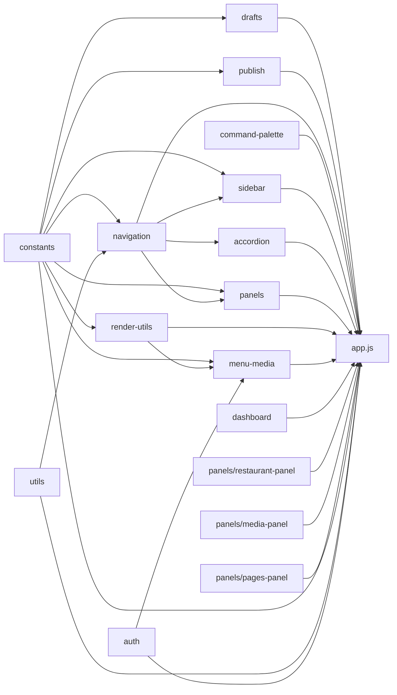

# Admin Modules Reference

> **Read this doc when** modifying a specific admin module, adding a new module, or understanding how modules interact with `app.js`.

## Contents

- [Overview](#overview)
- [Module Dependency Graph](#module-dependency-graph)
- [Module API Reference](#module-api-reference) — constants, utils, auth, drafts, publish, navigation, command-palette, sidebar, accordion, panels, render-utils, menu-media, dashboard, restaurant-panel, media-panel, pages-panel
- [Adding a New Module](#adding-a-new-module)

---

## Overview

The admin panel has **16 extracted modules** in `admin/app/modules/`, including the native `Restaurant`, `Media`, and `Pages` panels under `admin/app/modules/panels/`. Each module follows the same pattern:

1. **IIFE** wrapping all code in an immediately-invoked function expression
2. **Namespace registration** on `window.FigataAdmin`
3. **Export object** listing all public functions
4. **Context injection** — functions that need app state receive a `ctx` object from `app.js`

Modules are loaded via `<script>` tags in `admin/app/index.html`, **before** `app.js`.

---

## Module Dependency Graph



Arrows show "is used by" relationships. All modules register on `window.FigataAdmin` and are consumed by `app.js` via delegates.

---

## Module API Reference

### `constants.js` → `FigataAdmin.constants`

Pure configuration values. No functions, only data constants.

| Export | Purpose |
|--------|---------|
| `DATA_ENDPOINTS` | Map of data file names to JSON endpoint URLs |
| `SIDEBAR_COLLAPSE_KEY` | localStorage key for sidebar collapse state |
| `MENU_PLACEHOLDER_IMAGE` | Default placeholder image path for menu items |
| `MENU_MEDIA_ROOT` | Root directory for menu media assets |
| `LOCAL_MEDIA_OPTIONS_ENDPOINT` | Dev server media listing endpoint |
| `LOCAL_DRAFTS_*_KEY` | localStorage keys for each draft type (menu, availability, home, ingredients, categories) |
| `LOCAL_DRAFTS_FLAG_KEY` | localStorage flag indicating drafts exist |
| `DEV_AUTH_BYPASS_KEY` | localStorage key for dev auth bypass |
| `UX_TIMING` | Timing constants for animations (accordion, panel transitions, scroll spy) |
| `DEBUG_NAVIGATION` | Boolean flag for navigation debug logging |
| `NAVIGATION_STATES` | Enum of navigation FSM states |
| `NAVIGATION_STATE_GRAPH` | Valid state transitions for navigation FSM |
| `HOME_*` | Homepage editor limits, defaults, and section definitions |
| `INGREDIENT_*` | Ingredient category definitions, SVG icons, keyword mappings |

**Ctx required:** None (pure data, accessed directly).

---

### `utils.js` → `FigataAdmin.utils`

| Export | Signature | Purpose |
|--------|-----------|---------|
| `deepClone` | `(obj)` | Deep clone via JSON parse/stringify |
| `getInitials` | `(name)` | Extract initials from a display name |
| `downloadJsonFile` | `(data, filename)` | Trigger a JSON file download in the browser |
| `parseCssTimeToMs` | `(cssTime)` | Convert CSS time string (e.g., `"0.3s"`) to milliseconds |

**Ctx required:** None (pure functions).

---

### `auth.js` → `FigataAdmin.auth`

| Export | Signature | Purpose |
|--------|-----------|---------|
| `getIdentity` | `()` | Get the Netlify Identity widget instance |
| `isLocalDevHost` | `()` | True if running on localhost/127.0.0.1 |
| `setDevAuthBypass` | `(enabled)` | Enable/disable dev auth bypass in localStorage |
| `isDevAuthBypassEnabled` | `()` | Check if dev auth bypass is active |
| `applyDevAuthBypassQueryToggle` | `()` | Handle `?devAuthBypass=1` query parameter |
| `createLocalBypassUser` | `()` | Create a fake user object for local development |
| `getUserEmail` | `(user)` | Extract email from a Netlify Identity user object |
| `getUserDisplayName` | `(user)` | Extract display name from a Netlify Identity user object |

**Ctx required:** None (reads only from DOM/localStorage/window).

---

### `drafts.js` → `FigataAdmin.drafts`

| Export | Signature | Purpose |
|--------|-----------|---------|
| `clearPersistedDraftsStorage` | `()` | Remove all draft keys from localStorage |
| `persistDraftsToLocalStorage` | `(drafts)` | Save current drafts to localStorage |
| `hydrateDraftsFromLocalStorage` | `(state, callbacks)` | Restore drafts from localStorage on startup |

**Callbacks shape:**
```js
{
  ensureMenuDraft: fn,
  ensureAvailabilityDraft: fn,
  ensureHomeDraft: fn,
  ensureIngredientsDraft: fn,
  ensureCategoriesDraft: fn,
  ensureRestaurantDraft: fn,
  ensureMediaDraft: fn
}
```

---

### `publish.js` → `FigataAdmin.publish`

| Export | Signature | Purpose |
|--------|-----------|---------|
| `publishChanges` | `(target, ctx)` | Validate drafts, then POST to Netlify publish function |

**Ctx shape:**
```js
{
  state: state,
  publishButtonSets: [ ... ],
  getPublishButtonSet: fn,
  getAllPublishButtonSets: fn,
  setCurrentEditorStatus: fn,
  setDataStatus: fn,
  ensureMediaStore: fn,
  ensureMediaDraft: fn,
  ensureRestaurantDraft: fn,
  ensureIngredientsDraft: fn,
  ensureCategoriesDraft: fn,
  normalizeIngredientsAliasesPayload: fn,
  validateIngredientsDraftData: fn,
  validateCategoriesDraftData: fn,
  renderIngredientsEditorValidationSummary: fn,
  renderIngredientsGlobalWarnings: fn,
  renderCategoriesValidationSummary: fn,
  renderCategoriesGlobalWarnings: fn
}
```

---

### `navigation.js` → `FigataAdmin.navigation`

| Group | Exports |
|-------|---------|
| **Transition helpers** | `waitNextFrame(fn)`, `hasTransitionDuration(el)`, `getRunningAnimations(el)`, `waitForTransition(el)`, `waitForAnimation(el)` |
| **State machine** | `getNavigationState(ctx)`, `canTransitionNavigationState(ctx, target)`, `setNavigationState(ctx, target)`, `setNavigationCurrentPanel(ctx, panel)`, `setNavigationCurrentSection(ctx, section)`, `isNavigationStateIdle(ctx)`, `canRunScrollSpy(ctx)` |
| **Scroll lock** | `isProgrammaticScrollLocked(ctx)`, `clearProgrammaticScrollLock(ctx)`, `lockProgrammaticScroll(ctx, duration)`, `runWithProgrammaticScrollLock(ctx, fn, duration)` |
| **Post-nav actions** | `queuePanelPostNavigationAction(ctx, panel, action)`, `flushPanelPostNavigationAction(ctx, panel)`, `clearPanelPostNavigationActions(ctx)` |
| **Timeline** | `createNavigationTimelineCancelError()`, `isNavigationTimelineCurrent(ctx, token)`, `assertNavigationTimelineActive(ctx, token)`, `runNavigationTimeline(ctx, fn)` |

**Ctx shape:** `{ state: state }` (reads `state.navigation`, `state.programmaticScrollLockUntil`, `state.panelPostNavigationActions`, `state.navigationTimelineToken`).

---

### `command-palette.js` → `FigataAdmin.commandPalette`

| Export | Signature | Purpose |
|--------|-----------|---------|
| `getItems` | `(ctx)` | Build the list of available commands |
| `isOpen` | `(ctx)` | Check if palette is visible |
| `setLiveMessage` | `(ctx, msg)` | Set the ARIA live region message |
| `getItemIndex` | `(ctx, item)` | Get index of an item in the list |
| `setSelectedIndex` | `(ctx, index)` | Highlight an item by index |
| `open` | `(ctx)` | Show the palette |
| `close` | `(ctx)` | Hide the palette |
| `toggle` | `(ctx)` | Toggle visibility |
| `activateItem` | `(ctx, item)` | Execute a command from the palette |
| `handleKeydown` | `(ctx, event)` | Handle keyboard navigation (↑, ↓, Enter, Esc) |
| `bindEvents` | `(ctx)` | Attach event listeners |

**Ctx shape:** `{ state: state, elements: { commandPaletteShell, commandPaletteOverlay, commandPaletteDialog, commandPaletteInput, commandPaletteList, commandPaletteLive }, openDashboard, openMenuBrowser, openHomePageEditor, openIngredientsEditor, openCategoriesEditor, publishChanges, refreshDataButton, toggleSidebarUserMenu }`

---

### `sidebar.js` → `FigataAdmin.sidebar`

| Export | Signature | Purpose |
|--------|-----------|---------|
| `readStoredSidebarCollapsed` | `()` | Read collapsed state from localStorage |
| `isCompactViewport` | `()` | Check if viewport is below compact breakpoint |
| `setSidebarCollapsed` | `(ctx, collapsed, opts)` | Expand/collapse the sidebar with animation |
| `syncSidebarViewportState` | `(ctx)` | Sync sidebar to viewport width on resize |
| `isSidebarUserMenuOpen` | `(ctx)` | Check if user dropdown is visible |
| `closeSidebarUserMenu` | `(ctx)` | Close user dropdown |
| `openSidebarUserMenu` | `(ctx)` | Open user dropdown |
| `toggleSidebarUserMenu` | `(ctx)` | Toggle user dropdown |
| `syncUxTimingCssVars` | `()` | Sync JS timing constants to CSS custom properties |

**Ctx factory:** `_sbCtx()` in `app.js`.

---

### `accordion.js` → `FigataAdmin.accordion`

| Group | Exports |
|-------|---------|
| **DOM motion** | `syncSidebarAccordionCategoryHeights`, `clearSidebarAccordionOpeningMotion`, `prepareSidebarAccordionOpeningMotion`, `scheduleSidebarAccordionOpeningMotion`, `finalizeSidebarAccordionOpeningMotion`, `setSidebarAccordionElementState` |
| **Element-aware** | `clearAllSidebarAccordionOpeningMotions`, `syncAllSidebarAccordionCategoryHeights`, `showMenuAccordion`, `showHomepageAccordion`, `showPagesAccordion`, `showIngredientsAccordion`, `showCategoriesAccordion`, `showRestaurantAccordion`, `showMediaAccordion`, `getSidebarAccordionKeyForPanel`, `getSidebarOpenAccordionKeyFromDom`, `getSidebarAccordionElementByKey`, `isSidebarAccordionOpening`, `applySidebarAccordionState`, `transitionSidebarAccordions` |
| **Indicator** | `updateSidebarActiveIndicator`, `clearSidebarIndicatorSyncTimers`, `scheduleSidebarActiveIndicatorSync` |

**Ctx factory:** `_acCtx()` in `app.js`.

---

### `panels.js` → `FigataAdmin.panels`

| Export | Signature | Purpose |
|--------|-----------|---------|
| `getPanelScrollSpyAdapter` | `(ctx, panel)` | Get the scroll spy config for a panel |
| `syncVisiblePanelAnchors` | `(ctx)` | Update anchor positions for current panel |
| `requestCurrentPanelScrollSpySync` | `(ctx)` | Schedule anchor sync via requestAnimationFrame |
| `requestCurrentPanelScrollSpyUpdate` | `(ctx)` | Schedule scroll spy update |
| `applyPanelVisibility` | `(ctx, panel)` | Show/hide panel elements |
| `setActiveSidebarNav` | `(ctx, panel)` | Highlight the correct sidebar nav item |
| `clearPanelTransitionTimers` | `(ctx)` | Cancel pending transition timers |
| `moveSidebarIndicatorForTimeline` | `(ctx, panel)` | Move the sidebar active indicator during transitions |
| `runPanelTransition` | `(ctx, targetPanel, opts)` | Run the full panel switch transition |
| `setActivePanel` | `(ctx, panel)` | Set active panel (triggers transition if needed) |

**Ctx factory:** `_pnCtx()` in `app.js`.

---

### `render-utils.js` → `FigataAdmin.renderUtils`

| Group | Exports |
|-------|---------|
| **Text** | `normalizeText(value)`, `escapeHtml(value)`, `slugify(value)`, `buildHtmlAttributes(attrs)` |
| **Asset paths** | `resolveAssetPath(path)`, `toRelativeAssetPath(path)`, `getPathExtension(path)`, `removePathExtension(path)`, `isSvgPlaceholderPath(path)`, `isMenuMediaPath(path)`, `buildMenuMediaCandidates(rawPath)` |
| **Toggle component** | `registerToggleHandler(id, onChange)`, `resolveToggleChecked(control)`, `setToggleChecked(control, checked)`, `setToggleDisabled(control, disabled)`, `getToggleChecked(control)`, `renderToggle(options)`, `triggerToggleChange(control, checked, event, fallbackOnChange)`, `bindToggles(rootEl, options)` |

**Ctx required:** None (pure functions, uses `FigataAdmin.constants` internally).

---

### `menu-media.js` → `FigataAdmin.menuMedia`

| Export | Signature | Purpose |
|--------|-----------|---------|
| `resolveMenuMediaPath` | `(ctx, rawPath, allowFallback)` | Resolve a media path against known paths index |
| `setImageElementSourceWithFallback` | `(imgEl, path, fallbackPath)` | Set image src with error fallback |
| `fetchLocalMenuMediaPaths` | `()` | Fetch available media paths from dev server |
| `fetchJson` | `(endpoint)` | Generic JSON fetch with error handling |

**Ctx shape (resolveMenuMediaPath only):** `{ state: state }` (reads `state.indexes.menuMediaPathSet`).

---

### `dashboard.js` → `FigataAdmin.dashboard`

| Export | Signature | Purpose |
|--------|-----------|---------|
| `updateDashboardMetrics` | `(ctx)` | Populate all dashboard metric displays |
| `openDashboard` | `(ctx, options)` | Open the dashboard panel |

**Ctx factory:** `_dbCtx()` in `app.js`.

---

### `panels/restaurant-panel.js` → `FigataAdmin.restaurantPanel`

| Export | Signature | Purpose |
|--------|-----------|---------|
| `open` | `(ctx, options)` | Open the native Restaurant panel and sync the route |
| `render` | `(ctx)` | Render the full `restaurant.json` editor form |
| `syncToDraft` | `(ctx)` | Copy current form fields into `state.drafts.restaurant` |
| `bindEvents` | `(ctx)` | Attach delegated input/click handlers for save/export/publish |
| `sections` | `array` | Section metadata used by the shared sidebar accordion and scroll spy |
| `normalizeSectionId` | `(sectionId)` | Normalize a Restaurant section ID |
| `getSectionAnchorId` | `(sectionId)` | Build the DOM anchor ID for a Restaurant section |

**Ctx factory:** `_restCtx()` in `app.js`.

---

### `panels/media-panel.js` → `FigataAdmin.mediaPanel`

| Export | Signature | Purpose |
|--------|-----------|---------|
| `open` | `(ctx, options)` | Open the native Media panel and sync the route |
| `render` | `(ctx)` | Render grouped browser + global sections, or dedicated item subview (`#/media/item/:id`) |
| `bindEvents` | `(ctx)` | Attach delegated handlers for search, item selection, save, export, and publish |
| `sections` | `array` | Section metadata used by the shared sidebar accordion and scroll spy |
| `normalizeSectionId` | `(sectionId)` | Normalize a Media section ID |
| `getSectionAnchorId` | `(sectionId)` | Build the DOM anchor ID for a Media section |

**Ctx factory:** `_mediaCtx()` in `app.js`.

---

### `panels/pages-panel.js` → `FigataAdmin.pagesPanel`

| Export | Signature | Purpose |
|--------|-----------|---------|
| `open` | `(ctx, options)` | Open the native Pages panel and sync `#/pages` |
| `render` | `(ctx)` | Render the scaffold sections for unique site pages |
| `bindEvents` | `(ctx)` | Attach lightweight panel-level events |
| `sections` | `array` | Sidebar/scroll-spy metadata (`menu`, `nosotros`, `ubicacion`, `contacto`, `eventos`, `faqs`) |
| `normalizeSectionId` | `(sectionId)` | Normalize a Pages section ID |
| `getSectionAnchorId` | `(sectionId)` | Build the DOM anchor ID for a Pages section |

**Ctx factory:** `_pagesCtx()` in `app.js`.

---

## Adding a New Module

1. Create `admin/app/modules/your-module.js`:
   ```js
   (function () {
     "use strict";
     var ns = window.FigataAdmin = window.FigataAdmin || {};
     // ... define functions ...
     ns.yourModule = { exportedFn: exportedFn };
   })();
   ```

2. Add `<script>` tag in `admin/app/index.html` before `app.js`

3. In `app.js`, create a ctx factory and delegates:
   ```js
   var YM = window.FigataAdmin.yourModule;
   function _ymCtx() { return { state: state, ... }; }
   function exportedFn(args) { return YM.exportedFn(_ymCtx(), args); }
   ```

4. Update this doc's module table, `AGENTS.md` script loading order, and `admin-panel.md` module map

5. Verify: `node --check admin/app/modules/your-module.js && node --check admin/app/app.js`
