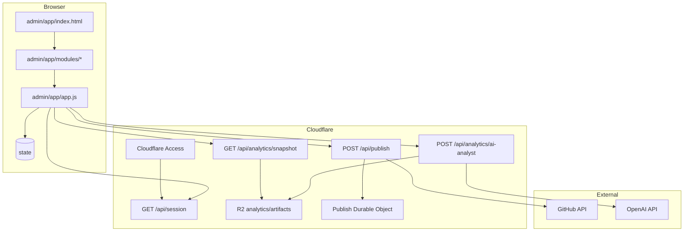

# Admin Panel

> **Read this doc when** working on anything inside `admin/app/`, including the shell, modules, auth flow, dashboard, publish UI, or panel routing.

## Overview

The Admin Panel is a vanilla-JS SPA mounted at `/admin/app/`.

It is now deployed as a **dedicated Cloudflare Pages admin surface** and protected by **Cloudflare Access + Google allowlist**.

| Aspect | Details |
|------|---------|
| Entry point | `admin/app/index.html` |
| Main app | `admin/app/app.js` |
| Modules | `admin/app/modules/` |
| Styles | `admin/app/styles.css` |
| Production auth | Cloudflare Access + `GET /api/session` |
| Local auth | `?devAuthBypass=1` |
| Publish API | `POST /api/publish` |
| Analytics snapshot API | `GET /api/analytics/snapshot` |
| AI analyst API | `POST /api/analytics/ai-analyst` |
| Routes | Hash-based inside the SPA |

## Architecture



## Auth Model

### Production / Preview

The browser no longer logs in through an embedded widget.

Instead:
- the user opens `admin.trattoriafigata.com` or `preview-admin.trattoriafigata.com`
- Cloudflare Access challenges with Google before the app loads
- the app calls `GET /api/session`
- the worker returns the already-verified identity payload

### Local development

Use:

```txt
http://127.0.0.1:5173/admin/app/?devAuthBypass=1
```

That bypass exists only on localhost.

## Core Runtime Files

| File | Responsibility |
|------|----------------|
| `admin/app/index.html` | Admin shell, login view, command palette, panel containers |
| `admin/app/app.js` | App bootstrap, state, delegates, routing, editor logic |
| `admin/app/modules/auth.js` | Cloudflare session fetch, local bypass, logout redirect |
| `admin/app/modules/publish.js` | Publish UX + request to `/api/publish` |
| `admin/app/modules/dashboard.js` | Dashboard KPIs, analytics filters, AI analyst chat |
| `cloudflare/admin/worker.js` | Admin API runtime |
| `cloudflare/common/access.js` | Access JWT/session verification |

## Supported Routes / Panels

Common hash routes:
- `#/dashboard`
- `#/menu`
- `#/menu/new`
- `#/menu/item/:id`
- `#/home`
- `#/pages`
- `#/ingredients`
- `#/categories`
- `#/restaurant`
- `#/media`
- `#/media/item/:id`

The external URL stays on the admin host. Internal panel navigation stays hash-based.

## Session UX

The login screen is now informational only. In production it tells the user the Admin is protected by Cloudflare Access and Google.

Important behaviors:
- `Entrar con Google` triggers a reload back into the Access gate
- `Cerrar sesion` redirects to `/cdn-cgi/access/logout`
- local bypass uses a synthetic session payload so the SPA can boot without Cloudflare

## Dashboard and Analytics

The dashboard consumes:
- `GET /api/analytics/snapshot` in Cloudflare environments
- `GET /__analytics/inspect` in local dev

The AI chat consumes:
- `POST /api/analytics/ai-analyst` in Cloudflare environments
- `POST /__analytics/ai-analyst` in local dev

The browser never calculates KPI formulas on its own. It renders the structured payload returned by the backend.

## Publish Flow

The Admin browser validates and submits drafts, but the authoritative publish logic lives on the Cloudflare worker.

Production uses:
- Access-authenticated identity
- Durable Object lease/rate limit
- GitHub diff-based commits

See `docs/developers/workflows/publish-pipeline.md` for the full publish contract.

## Module Loading Order

`constants` -> `utils` -> `auth` -> `drafts` -> `publish` -> `navigation` -> `command-palette` -> `sidebar` -> `accordion` -> `panels` -> `render-utils` -> `menu-media` -> `dashboard` -> `panels/restaurant-panel` -> `panels/media-panel` -> `panels/pages-panel` -> `app.js`

Keep that order stable because `app.js` delegates to globals already registered on `window.FigataAdmin`.

## Cloudflare Build Notes

The Admin is packaged into `dist-admin/` by:

```bash
npm run build-cloudflare-admin
```

That output includes:
- `admin/app/`
- `assets/`
- `data/`
- `shared/`
- generated `_worker.js`
- root redirect from `/` to `/admin/app/`

`admin/cms/` is intentionally excluded from the Cloudflare admin build.

## Legacy Notes

- Netlify Identity is no longer the supported auth path.
- `admin/cms/` is archived legacy material.
