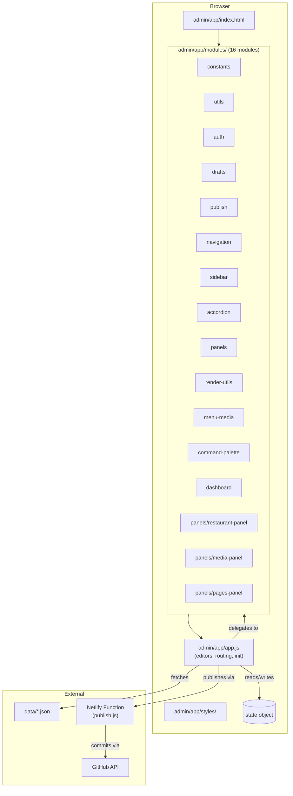

# Admin Panel

> **Read this doc when** working on anything inside `admin/app/`, including modules, the main `app.js`, admin HTML, admin CSS, or admin behavior.

## Contents

- [Overview](#overview)
- [Architecture](#architecture) — code organization, module map, context injection
- [State Object](#state-object) — data, drafts, indexes, navigation, editor sub-states
- [Views and Elements](#views-and-elements) — panel containers, DOM element registry
- [Routing](#routing) — hash routes, route table, routing functions
- [Editor Panels](#editor-panels) — menu browser, item editor, homepage, pages, ingredients, categories, restaurant, media
- [Remaining Code in app.js](#remaining-code-in-appjs)
- [Development](#development) — local setup, adding modules, debugging

---

## Overview

The admin panel is a **single-page application** at `/admin/app/`. It allows restaurant staff to manage menu items, ingredients, categories, homepage content, and publish changes to the live site.

| Aspect | Details |
|--------|---------|
| Entry point | `admin/app/index.html` |
| Main logic | `admin/app/app.js` (~9,765 lines) |
| Modules | `admin/app/modules/` (16 extracted modules, including native Restaurant/Media/Pages panels) |
| Styles | `admin/app/styles/` |
| Auth | Netlify Identity; dev bypass via `?devAuthBypass=1` |
| Routing | Hash-based (`#/dashboard`, `#/menu`, `#/pages`, `#/restaurant`, `#/media`, `#/media/item/:id`, etc.) |
| State | Single `state` object in the IIFE closure of `app.js` |
| No build step | Scripts loaded directly via `<script>` tags |

---

## Architecture

### High-Level Architecture



### Code Organization

The admin panel follows a **namespace + IIFE + delegate** pattern:

```
app.js (main IIFE)
  ├── state object              → centralized application state
  ├── views object              → references to panel container elements
  ├── elements object           → references to ~100 DOM elements by ID
  ├── delegate blocks           → one-line forwarding stubs to extracted modules
  └── remaining business logic  → editors, routing, event binding, init
```

Each extracted module lives in `admin/app/modules/`, is wrapped in its own IIFE, and registers exports on the `window.FigataAdmin` namespace. In `app.js`, the original function is replaced with a **delegate** — a one-line function that calls the module and passes any required context (state, elements, callbacks).

### Module Map

| Module | Namespace | Functions | Purpose |
|--------|-----------|----------:|---------|
| `constants.js` | `FigataAdmin.constants` | ~45 | Shared constants (endpoints, keys, timing, limits, defaults) |
| `utils.js` | `FigataAdmin.utils` | 4 | Pure utilities (deepClone, getInitials, downloadJsonFile, parseCssTimeToMs) |
| `auth.js` | `FigataAdmin.auth` | 8 | Netlify Identity helpers, dev bypass detection |
| `drafts.js` | `FigataAdmin.drafts` | 3 | localStorage persistence: clear, save, hydrate |
| `publish.js` | `FigataAdmin.publish` | 1 | Publish flow (validate → send to Netlify function) |
| `navigation.js` | `FigataAdmin.navigation` | 22 | Navigation state machine, scroll lock, transition/animation helpers |
| `command-palette.js` | `FigataAdmin.commandPalette` | 11 | ⌘K command palette: open, close, search, activate |
| `sidebar.js` | `FigataAdmin.sidebar` | 9 | Sidebar collapse/expand, user menu, viewport sync |
| `accordion.js` | `FigataAdmin.accordion` | 21 | Sidebar accordion motion, opening animations, active indicator |
| `panels.js` | `FigataAdmin.panels` | 10 | Panel transitions, scroll spy adapters, visibility |
| `render-utils.js` | `FigataAdmin.renderUtils` | 20 | HTML escaping, slugify, asset paths, toggle component system |
| `menu-media.js` | `FigataAdmin.menuMedia` | 4 | Menu media path resolution, image fallbacks, fetchJson |
| `dashboard.js` | `FigataAdmin.dashboard` | 2 | Dashboard metrics display, panel opener |
| `panels/restaurant-panel.js` | `FigataAdmin.restaurantPanel` | 4 | Native Restaurant panel: open, render, sync, bind |
| `panels/media-panel.js` | `FigataAdmin.mediaPanel` | 3 | Native Media panel: open, render, bind |
| `panels/pages-panel.js` | `FigataAdmin.pagesPanel` | 3 | Native Pages panel scaffold: open, render, bind |

### Script Loading Order

Modules must load **before** `app.js` in `admin/app/index.html`:

```
constants → utils → auth → drafts → publish → navigation →
command-palette → sidebar → accordion → panels → render-utils →
menu-media → dashboard → panels/restaurant-panel → panels/media-panel → panels/pages-panel → app.js
```

### Context Injection Pattern

Functions that need access to `state`, `elements`, or other functions receive a **ctx** (context) object. Each group of related delegates has a **lazy factory** that constructs the ctx:

```js
// Example: sidebar context factory in app.js
function _sbCtx() {
  return {
    state: state,
    elements: { sidebar: elements.sidebar, ... },
    waitForTransition: waitForTransition,
    updateSidebarActiveIndicator: updateSidebarActiveIndicator,
    ...
  };
}
function setSidebarCollapsed(next, opts) {
  return SB.setSidebarCollapsed(_sbCtx(), next, opts);
}
```

Current ctx factories in `app.js`: `_sbCtx()` (sidebar), `_acCtx()` (accordion), `_pnCtx()` (panels), `_cpCtx()` (command palette), `_dbCtx()` (dashboard), `_restCtx()` (restaurant), `_mediaCtx()` (media), `_pagesCtx()` (pages), plus inline ctx objects for navigation, drafts, and publish.

---

## State Object

The `state` object is the centralized store for all admin panel data. Defined at the top of `app.js`.

### Top-Level Properties

| Property | Type | Purpose |
|----------|------|---------|
| `data` | `object \| null` | Raw fetched data from all `data/*.json` endpoints |
| `drafts` | `object` | Working copies of data being edited (menu, availability, home, ingredients, categories, restaurant, media) |
| `indexes` | `object` | Derived indexes built from data (category lists, ingredient maps, media paths) |
| `isDataLoading` | `boolean` | True while fetching data from endpoints |
| `hasDataLoaded` | `boolean` | True after initial data fetch completes |
| `isPublishing` | `boolean` | True during publish operation |
| `currentPanel` | `string` | Active panel ID (`"dashboard"`, `"menu-browser"`, `"menu-item"`, `"home-editor"`, `"pages-editor"`, `"ingredients-editor"`, `"categories-editor"`, `"restaurant-editor"`, `"media-editor"`) |
| `visiblePanel` | `string` | Currently visible panel (may differ during transitions) |

### Navigation Sub-State

| Property | Purpose |
|----------|---------|
| `navigation.currentState` | FSM state (idle, transitioning, scrolling, etc.) |
| `navigation.currentPanel` | Panel the navigation system considers active |
| `navigation.currentSection` | Active section within the current panel |
| `navigation.isProgrammaticScroll` | True during script-driven scroll (suppresses scroll spy) |
| `navigationTimelineToken` | Monotonic counter for cancelling stale transitions |
| `sidebarAccordionOpenKey` | Which sidebar accordion is currently expanded |

### Editor Sub-States

| Property | Purpose |
|----------|---------|
| `itemEditor` | Item editor state: `isOpen`, `isNew`, `activeTab`, `draft`, `sourceSectionId`, `sourceItemIndex` |
| `ingredientsEditor` | Ingredients editor state: `tab`, `view`, `search`, `selectedIngredientId`, `draft`, `validationReport`, icon sub-editor state |
| `categoriesEditor` | Categories editor state: `activeCategoryId`, `validationReport`, `draftBySourceIndex`, `newDraft` |
| `commandPalette` | Command palette state: `isOpen`, `selectedIndex` |

### Drafts Object

| Key | Source | Modified by |
|-----|--------|------------|
| `drafts.menu` | `data/menu.json` | Menu browser, item editor |
| `drafts.availability` | `data/availability.json` | Item editor |
| `drafts.home` | `data/home.json` | Home editor |
| `drafts.ingredients` | `data/ingredients.json` | Ingredients editor |
| `drafts.categories` | `data/categories.json` | Categories editor |
| `drafts.restaurant` | `data/restaurant.json` | Restaurant editor |
| `drafts.media` | `data/media.json` | Media editor |

Drafts are lazily initialized (via `ensureMenuDraft()`, `ensureHomeDraft()`, etc.) and persisted to `localStorage` for crash recovery.

---

## Views and Elements

### Views Registry

Panel container elements, used for panel visibility toggling:

| Key | Element ID | Panel |
|-----|-----------|-------|
| `login` | `login-view` | Login screen |
| `dashboard` | `dashboard-view` | Dashboard wrapper |
| `dashboardPanel` | `dashboard-panel` | Dashboard content |
| `menuBrowserPanel` | `menu-browser-panel` | Menu browser |
| `menuItemPanel` | `menu-item-panel` | Item editor |
| `homeEditorPanel` | `home-editor-panel` | Homepage editor |
| `pagesEditorPanel` | `pages-editor-panel` | Pages scaffold editor |
| `ingredientsEditorPanel` | `ingredients-editor-panel` | Ingredients editor |
| `categoriesEditorPanel` | `categories-editor-panel` | Categories editor |
| `restaurantEditorPanel` | `restaurant-editor-panel` | Restaurant editor |
| `mediaEditorPanel` | `media-editor-panel` | Media editor |

### Elements Registry

The `elements` object references ~100 DOM elements by ID. These are organized by area:

| Area | Prefix | Examples |
|------|--------|---------|
| Sidebar | `sidebar*` | `sidebar`, `sidebarNav`, `sidebarNavDashboard`, `sidebarNavPages`, `sidebarNavRestaurant`, `sidebarNavMedia`, `sidebarMenuAccordion`, `sidebarPagesAccordion`, `sidebarRestaurantAccordion`, `sidebarMediaAccordion`, `sidebarUserButton` |
| Command palette | `commandPalette*` | `commandPaletteShell`, `commandPaletteDialog`, `commandPaletteInput` |
| Session/auth | `session*`, `login*` | `sessionName`, `sessionEmail`, `loginButton`, `logoutButton` |
| Dashboard metrics | `metric*` | `metricMenu`, `metricCategories`, `metricAvailability`, `metricRestaurant`, `metricMedia` |
| Menu browser | `menu*` | `menuBrowserStatus`, `menuBrowserGroups`, `menuNewItemButton` |
| Item editor | `item*` | `itemEditorTitle`, `itemFieldName`, `itemFieldPrice`, `itemSaveButton` |
| Home editor | `home*` | `homeEditorStatus`, `homeSectionsContent`, `homeSaveButton` |
| Ingredients editor | `ingredients*` | `ingredientsList`, `ingredientsFieldId`, `ingredientsSaveButton` |
| Categories editor | `categories*` | `categoriesCardsContent`, `categoriesOrderList`, `categoriesNewButton` |
| Preview | `preview*` | `previewCardImage`, `previewModalImage` |
| Topbar | `topbar` | `.topbar` element |

---

## Routing

The admin panel uses **hash-based routing**.

### Route Table

| Route Pattern | Panel | Handler |
|--------------|-------|---------|
| `#/dashboard` | Dashboard | `openDashboard()` |
| `#/menu` | Menu browser | `openMenuBrowser()` |
| `#/menu/new` | Item editor (new) | `openItemEditor()` with new item |
| `#/menu/item/:id` | Item editor (edit) | `openItemEditor()` for item by ID |
| `#/home` | Homepage editor | `openHomePageEditor()` |
| `#/home/:sectionId` | Homepage editor (section) | `openHomePageEditor()` then scroll to section |
| `#/pages` | Pages editor | `openPagesEditor()` |
| `#/pages/:sectionId` | Pages editor (section) | `openPagesEditor()` then scroll to section |
| `#/ingredients` | Ingredients editor | `openIngredientsEditor()` |
| `#/ingredients/:id` | Ingredients editor (item) | `openIngredientsEditor()` then select ingredient |
| `#/ingredients/icons` | Icons sub-editor | `openIngredientsEditor()` with icons tab |
| `#/ingredients/icons/:key` | Icons sub-editor (item) | `openIngredientsEditor()` then select icon |
| `#/categories` | Categories editor | `openCategoriesEditor()` |
| `#/restaurant` | Restaurant editor | `openRestaurantEditor()` |
| `#/media` | Media editor | `openMediaEditor()` |
| `#/media/item/:id` | Media item subview | `openMediaEditor()` with item context |

### Routing Functions (in `app.js`)

- `parseHashRoute()` — Parses `window.location.hash` into a route object
- `navigateToRoute(path, options)` — Sets the hash and triggers routing
- `applyRoute()` — Reads the current hash and dispatches to the appropriate panel opener
- `setHashSilently(path)` — Updates hash without triggering `hashchange`

---

## Editor Panels

Each editor follows a common pattern:

```
1. ensureDraft()         → Lazy-initialize the working draft from loaded data
2. setActivePanel()      → Show the panel via transition system
3. renderEditor()        → Build/update the HTML content
4. renderSidebarAccordion() → Update the sidebar navigation for this panel
5. bindEvents()          → Attach event listeners (done once on init)
```

### Panel: Menu Browser
- **Purpose:** Browse, search, and filter menu items across all sections
- **Key functions:** `renderMenuBrowser()`, `buildMenuGroups()`, `getMenuSections()`
- **Scroll spy:** Tracks visible section as user scrolls; highlights sidebar nav

### Panel: Item Editor
- **Purpose:** Create/edit a single menu item with tabbed form
- **Tabs:** Basic info, descriptions, ingredients/tags/allergens, media, availability, advanced
- **Key functions:** `openItemEditor()`, `saveItemEditorDraft()`, `deleteItem()`

### Panel: Homepage Editor
- **Purpose:** Edit homepage sections: hero, featured items, events, testimonials, footer
- **Key functions:** `renderHomeEditor()`, `saveHomeEditorChanges()`, `openHomePageEditor()`
- **Scroll spy:** Section-based within the homepage editor

### Panel: Ingredients Editor
- **Purpose:** CRUD for ingredients catalog and icon library
- **Sub-views:** Ingredients catalog → ingredient detail; Icons catalog → icon detail
- **Key functions:** `renderIngredientsEditor()`, `saveIngredientsEditorDraft()`, `selectIngredientForEditing()`
- **Tabs:** Ingredients tab (catalog + detail), Icons tab (catalog + detail)

### Panel: Categories Editor
- **Purpose:** CRUD for menu categories with ordering and visibility
- **Key functions:** `renderCategoriesEditor()`, `saveCategoryDraftBySourceIndex()`, `openCategoriesEditor()`
- **Features:** Drag-and-drop reorder, inline editing, validation display

### Panel: Pages Editor
- **Purpose:** Native scaffold for unique site pages (`Menu`, `Nosotros`, `Ubicación`, `Contacto`, `Eventos`, `FAQs`) excluding HomePage
- **Key functions:** `openPagesEditor()`, `pagesPanel.render()`, `renderSidebarPagesAccordion()`
- **Internal navigation:** Section-based sidebar accordion + scroll spy (`menu`, `nosotros`, `ubicacion`, `contacto`, `eventos`, `faqs`)
- **Current scope:** Visual placeholders only; no per-page content editor yet

### Panel: Restaurant Editor
- **Purpose:** Edit restaurant identity, contact info, location, schedule, links, and metadata in `data/restaurant.json`
- **Key functions:** `openRestaurantEditor()`, `restaurantPanel.render()`, `restaurantPanel.syncToDraft()`
- **Internal navigation:** Section-based sidebar accordion + scroll spy (`identity`, `contact`, `location`, `hours`, `links`, `branding`, `seo`, `metadata`)

### Panel: Media Editor
- **Purpose:** Edit `data/media.json` natively, including per-item variants and global site assets
- **Key functions:** `openMediaEditor()`, `mediaPanel.render()`, `mediaPanel.bindEvents()`
- **Internal navigation:** Section-based sidebar accordion + scroll spy (`browser`, `homepage`, `brand`, `defaults`, `integrity`)
- **Item editing flow:** Dedicated subview via `#/media/item/:id` (separate from the main section flow)

---

## Remaining Code in `app.js`

After 12 phases of extraction, `app.js` still contains ~9,765 lines. The remaining code includes:

| Area | Approximate Lines | Description |
|------|------------------:|-------------|
| State + elements init | ~380 | `state`, `views`, `elements`, `dragState` definitions |
| Delegate blocks | ~510 | One-line forwarding stubs to extracted modules |
| Status/banner setters | ~50 | `setDataStatus()`, `setDraftsBanner()`, etc. |
| Auth/login flow | ~40 | `activateLocalAuthBypass()`, `showLoginView()`, `showDashboardShell()` |
| Token/hash helpers | ~30 | `hashHasAuthToken()`, `clearHash()`, `openIdentityModal()`, `handleTokenFlow()` |
| Draft export/save | ~100 | `exportCurrentDrafts()`, `saveDraftsToLocalFiles()` |
| Draft ensure/normalize | ~650 | `ensureMenuDraft()`, `ensureHomeDraft()`, home/ingredient normalizers |
| Validation functions | ~400 | `validateIngredientsDraftData()`, `validateCategoriesDraftData()` |
| Menu data helpers | ~200 | `syncMediaEntryForItem()`, `getAllMenuItems()`, menu section helpers |
| Menu browser rendering | ~650 | `renderMenuBrowser()`, group/card builders |
| Item editor | ~590 | Item CRUD, form rendering, validation |
| Dashboard | ~35 | Delegates only (extracted to module) |
| Categories editor | ~1,500 | Full CRUD, drag-reorder, rendering, scroll spy |
| Home editor | ~955 | Section rendering, featured items, testimonials, footer |
| Ingredients editor | ~2,195 | Full CRUD for ingredients + icons, tabs, scroll spy |
| Routing | ~290 | `parseHashRoute()`, `navigateToRoute()`, `applyRoute()` |
| Event binding | ~1,420 | `bindSidebarEvents()`, `bindMenuBrowserEvents()`, per-panel binders |
| Init/bootstrap | ~160 | `initAuth()`, data loading, startup |

---

## Development

### Running Locally

```bash
npm run dev
# Opens http://127.0.0.1:5173
# Admin at: http://127.0.0.1:5173/admin/app/?devAuthBypass=1
```

### Adding a New Module

1. Create `admin/app/modules/your-module.js` using the IIFE + namespace pattern
2. Add a `<script>` tag in `admin/app/index.html` **before** `app.js`
3. In `app.js`, create a ctx factory if needed and replace function bodies with delegates
4. Update this doc's module table
5. Update `AGENTS.md` script loading order
6. Run `node --check admin/app/modules/your-module.js && node --check admin/app/app.js`

### Debugging Tips

- Open the browser console and inspect `window.FigataAdmin` to see all registered modules
- Check `FigataAdmin.constants` for configuration values
- Check individual modules (e.g., `FigataAdmin.navigation`) for exported functions
- The `state` object is in the IIFE closure — not directly accessible, but `updateDashboardMetrics` and other functions read from it
