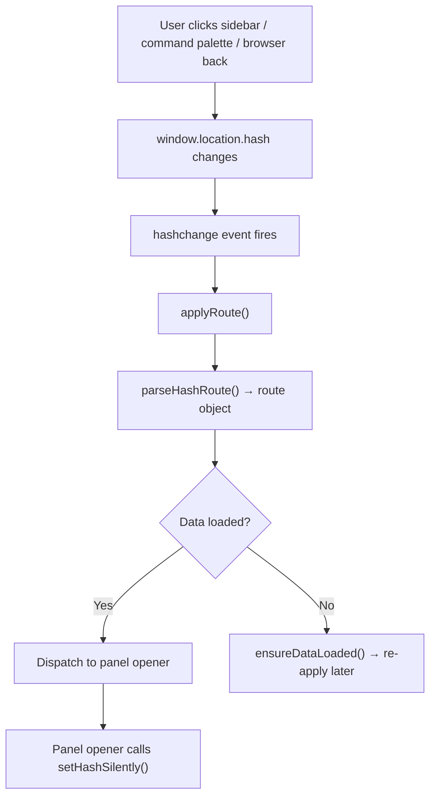
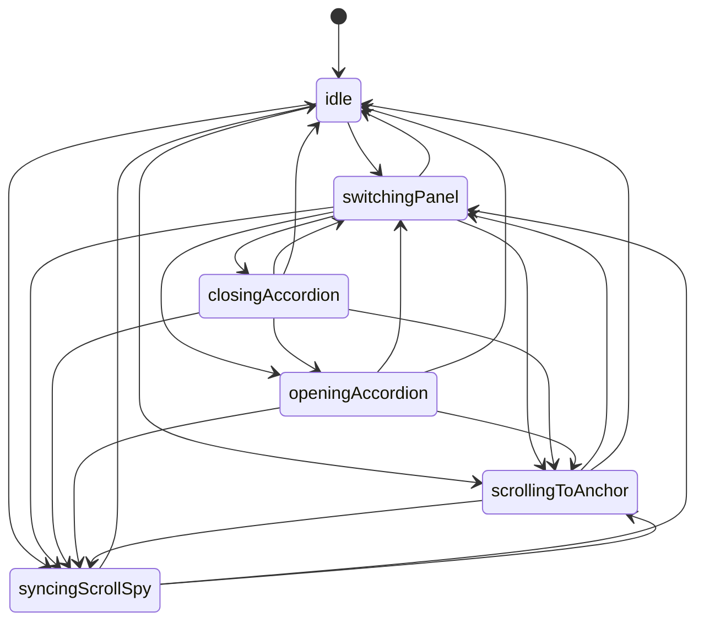

# Admin Routing and Navigation

> **Read this doc when** modifying routing, adding new panels/routes, debugging navigation or panel transition issues, or working with the navigation state machine.

## Contents

- [Overview](#overview)
- [Route Table](#route-table) — hash patterns, route dispatch, data-loading guard
- [Routing Functions](#routing-functions-in-appjs) — parseHashRoute, navigateToRoute, applyRoute
- [Navigation State Machine](#navigation-state-machine) — states, transitions, invariants
- [Panel Transition System](#panel-transition-system)
- [Scroll Spy](#scroll-spy)
- [Post-Navigation Actions](#post-navigation-actions)
- [Adding a New Route](#adding-a-new-route)

---

## Overview

The admin panel uses **hash-based routing**. Routing and navigation involve three layers:

| Layer | Code location | Purpose |
|-------|--------------|---------|
| **Route parsing** | `parseHashRoute()` in `app.js` | Parse `window.location.hash` into a route object |
| **Route dispatching** | `applyRoute()` in `app.js` | Map route objects to panel openers |
| **Navigation system** | `modules/navigation.js` + `modules/panels.js` | FSM, transitions, scroll spy, timelines |

---

## Route Table

### Hash → Route Object

`parseHashRoute()` converts the URL hash into a route object with a `name` and optional parameters:

| Hash pattern | Route name | Parameters |
|-------------|-----------|------------|
| `#/dashboard` (or empty) | `dashboard` | — |
| `#/menu` | `menu` | — |
| `#/menu/item/new` | `menu-item-new` | — |
| `#/menu/item/:id` | `menu-item` | `{ itemId }` |
| `#/menu/:categoryId` | `menu-section` | `{ categoryId }` |
| `#/home` or `#/homepage` | `homepage` | — |
| `#/home/:sectionId` or `#/homepage/:sectionId` | `homepage-section` | `{ sectionId }` |
| `#/ingredients` | `ingredients` | `{ tab: "ingredients" }` |
| `#/ingredients/ingredients` | `ingredients` | `{ tab: "ingredients" }` |
| `#/ingredients/icons` | `ingredients` | `{ tab: "icons" }` |
| `#/ingredients/new` | `ingredients-item` | `{ isNew: true }` |
| `#/ingredients/:id` | `ingredients-item` | `{ ingredientId }` |
| `#/ingredients/ingredients/:id` | `ingredients-item` | `{ tab: "ingredients", ingredientId }` |
| `#/ingredients/ingredients/new` | `ingredients-item` | `{ tab: "ingredients", isNew: true }` |
| `#/ingredients/icons/new` | `ingredients-icon` | `{ tab: "icons", isNew: true }` |
| `#/ingredients/icons/:key` | `ingredients-icon` | `{ tab: "icons", iconKey }` |
| `#/categories` | `categories` | — |
| `#/categories/:categoryId` | `categories-section` | `{ categoryId }` |
| Anything else | `dashboard` | — (fallback) |

### Route Object → Panel

`applyRoute()` dispatches each route name to the appropriate panel opener:

| Route name | Panel | Handler | Post-navigation action |
|-----------|-------|---------|----------------------|
| `dashboard` | Dashboard | `openDashboard()` | — |
| `menu` | Menu browser | `openMenuBrowser()` | — |
| `menu-item` | Item editor | `openItemEditor(itemId)` | — |
| `menu-item-new` | Item editor | `openNewItemEditor()` | — |
| `menu-section` | Menu browser | `openMenuBrowser()` | Scroll to category anchor |
| `homepage` | Home editor | `openHomePageEditor()` | — |
| `homepage-section` | Home editor | `openHomePageEditor()` | Scroll to section |
| `ingredients` | Ingredients editor | `openIngredientsEditor()` | Selects tab |
| `ingredients-item` | Ingredients editor | `selectIngredientForEditing()` or `beginNewIngredientDraft()` | — |
| `ingredients-icon` | Ingredients editor | `selectIconForEditing()` or `beginNewIconDraft()` | — |
| `categories` | Categories editor | `openCategoriesEditor()` | — |
| `categories-section` | Categories editor | `openCategoriesEditor()` | Scroll to category |

### Data-Loading Guard

All routes (except dashboard) check `state.hasDataLoaded` before proceeding. If data hasn't loaded yet, they call `ensureDataLoaded(false)` and return — the route will be re-applied after data loads.

---

## Routing Functions (in `app.js`)

| Function | Purpose |
|----------|---------|
| `parseHashRoute()` | Parse current hash into `{ name, itemId?, categoryId?, sectionId?, tab?, ... }` |
| `navigateToRoute(path, options)` | Set `window.location.hash` and trigger routing. `options.replace` uses `replaceState`. |
| `applyRoute()` | Read current hash, parse it, and dispatch to the correct panel opener |
| `setHashSilently(path)` | Update the hash without triggering `hashchange` (used by panel openers to avoid double-routing) |

### How Hash Changes Trigger Routing



---

## Navigation State Machine

The navigation system (`modules/navigation.js`) uses a **finite state machine** to coordinate panel transitions, accordion animations, scroll spy, and programmatic scrolling.

### States

| State | Meaning |
|-------|---------|
| `idle` | No navigation in progress. Scroll spy is active. |
| `switchingPanel` | A panel transition is in progress |
| `closingAccordion` | A sidebar accordion is closing (part of panel switch) |
| `openingAccordion` | A sidebar accordion is opening (part of panel switch) |
| `scrollingToAnchor` | A programmatic scroll to a section/anchor is in progress |
| `syncingScrollSpy` | Re-synchronizing scroll spy after a navigation action |

### State Transition Graph



All states can also transition to themselves (re-entry for nested transition cancellation).

### Key Invariants

1. **Scroll spy only runs in `idle` state** (or `syncingScrollSpy` with `forceSync`).
2. **Panel transitions increment `navigationTimelineToken`**, which invalidates any previous in-flight timeline.
3. **Programmatic scroll lock** prevents scroll spy from firing during code-driven scrolls. Lock expires after a timeout + buffer.

---

## Panel Transition System

Panel transitions are orchestrated by `setActivePanel()` (in `modules/panels.js`), which uses the **navigation timeline** system:

```
setActivePanel("menu-browser")
    ↓
runNavigationTimeline(state, [steps], { label })
    ↓
Step 1: Set navigation state → switchingPanel
Step 2: Close current accordion (if open) → closingAccordion
Step 3: Apply panel visibility (show target, hide others) → switchingPanel
Step 4: Open target accordion (if applicable) → openingAccordion
Step 5: Move sidebar active indicator
Step 6: Wait for transition animations
Step 7: Flush post-navigation actions (e.g., scroll to anchor)
Step 8: Set navigation state → syncingScrollSpy → idle
```

The timeline cancels any previously running timeline (via monotonic token comparison), preventing race conditions when the user navigates rapidly.

---

## Scroll Spy

Each panel with scrollable sections has its own scroll spy:

| Panel | State properties | Anchor data |
|-------|-----------------|-------------|
| Menu browser | `menuActiveAnchor`, `menuAnchorTargets`, `menuScrollSpyFrame` | Category/subcategory headings |
| Home editor | `homeActiveSectionId`, `homeAnchorTargets`, `homeScrollSpyFrame` | Home section IDs |
| Ingredients editor | `ingredientsAnchorTargets`, `ingredientsScrollSpyFrame` | Ingredient category sections |
| Categories editor | `categoriesAnchorTargets`, `categoriesScrollSpyFrame` | Category card sections |

Scroll spy works by:
1. **Syncing anchors:** Building a list of element+offset targets (`syncVisiblePanelAnchors`)
2. **On scroll:** Finding the topmost visible anchor and updating the sidebar accordion highlight
3. **Guarded by navigation state:** Only runs when `canRunScrollSpy()` returns true (idle state, no programmatic scroll lock)

---

## Post-Navigation Actions

Some routes need to scroll to a specific section after the panel opens. This is handled by the **post-navigation action queue**:

```js
// Queue an action to run after panel transition completes
queuePanelPostNavigationAction("menu-browser", function () {
  scrollToMenuAnchor(categoryId, "");
  setActiveMenuAnchor(categoryId, "", { force: true });
});
openMenuBrowser({ skipRoute: true });
```

Actions are flushed (executed and cleared) by `flushPanelPostNavigationAction()` during the panel transition's final step. Only one action can be queued per panel at a time.

---

## Adding a New Route

1. Add a pattern branch in `parseHashRoute()` (return a new route name)
2. Add a dispatch branch in `applyRoute()` (call the appropriate panel opener)
3. If the route needs a sidebar nav item, add it in `bindSidebarEvents()`
4. If the panel opener already exists, you may only need steps 1-2
5. Update this doc's route table
6. Update `AGENTS.md` task routing table if applicable
