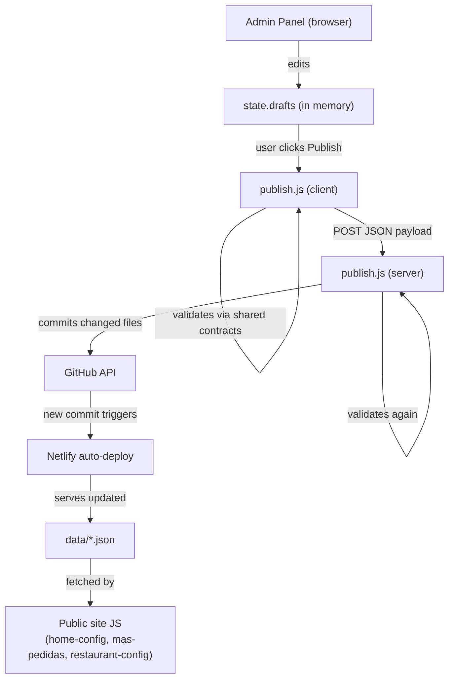

# Data Layer

> **Read this doc when** working with JSON data in `data/`, validation contracts in `shared/`, or any code that reads/writes menu, ingredient, category, home, or restaurant data.

## Contents

- [Overview](#overview)
- [Data Files](#data-files) — menu, categories, ingredients, availability, home, restaurant, media, media-variants, media-report
- [Validation Contracts](#validation-contracts) — ingredients-contract, categories-contract
- [Data Flow](#data-flow) — from admin drafts to live site
- [Key Rules](#key-rules)

---

## Overview

The data layer consists of **9 JSON files** in `data/` that serve as the shared data store between the public website and the admin panel. These files are committed to Git and deployed statically. The admin panel modifies them through a publish pipeline (Netlify serverless function).

Two **validation contracts** in `shared/` define the structural rules for ingredients and categories data. These contracts are used by both the admin panel (client-side validation before publish) and the publish pipeline (server-side validation before commit).

---

## Data Files

### `data/menu.json` — Menu Items

The primary menu data file. Contains all items grouped by section (category).

```
{
  "version": 1,
  "currency": "DOP",
  "taxIncluded": false,
  "sections": [
    {
      "id": "entradas",          // matches categories.json id
      "label": "Entradas",
      "items": [
        {
          "id": "berenjenas_parmesana",   // unique item identifier
          "name": "Berenjenas a la Parmesana",
          "slug": "berenjenas-parmesana", // URL-safe identifier
          "category": "entradas",        // parent section id
          "subcategory": "",             // optional grouping within section
          "descriptionShort": "",        // card view description
          "descriptionLong": "",         // modal/detail description
          "price": 550,                  // integer, in DOP
          "ingredients": ["berenjena", "salsa_de_tomate", ...],  // refs to ingredients.json
          "tags": ["vegetarian"],        // refs to ingredients.json tags
          "allergens": [],               // refs to ingredients.json allergens
          "image": "assets/berenjenas-parmesana.png",  // primary image path
          "featured": false,             // appears in homepage featured section
          "spicy_level": 0,              // 0-3 scale
          "vegetarian": true,
          "vegan": false,
          "available": true,             // runtime availability (also in availability.json)
          "reviews": "121 reseñas"       // optional social proof text
        }
      ]
    }
  ]
}
```

**Key relationships:**
- `sections[].id` corresponds to entries in `categories.json`
- `items[].ingredients` references keys in `ingredients.json → ingredients`
- `items[].tags` references keys in `ingredients.json → tags`
- `items[].allergens` references keys in `ingredients.json → allergens`
- `items[].id` is used as key in `media.json → items` and `availability.json → items`

---

### `data/categories.json` — Category Ordering & Visibility

Controls the display order and visibility of menu sections.

```
{
  "version": 1,
  "schema": "figata.menu.categories.v1",
  "categories": [
    {
      "id": "entradas",       // must match a section id in menu.json
      "label": "Entradas",    // display name
      "order": 1,             // sort position (ascending)
      "visible": true         // false = hidden from public site
    }
  ]
}
```

**Validated by:** `shared/categories-contract.js`, `scripts/validate-categories.js`

---

### `data/ingredients.json` — Ingredient Catalog

The complete ingredient catalog including icons, tags, and allergens.

```
{
  "version": 2,
  "basePath": "/assets/Ingredients/",
  "allergens": {
    "milk": { "id": "milk", "label": "Lácteos" },
    ...
  },
  "tags": {
    "vegetarian": { "id": "vegetarian", "label": "Vegetariano" },
    "spicy": { "id": "spicy", "label": "Picante" },
    ...
  },
  "icons": {
    "albahaca": {
      "icon": "/assets/Ingredients/albahaca.webp",   // WebP image path
      "label": "Albahaca",
      "covers": ["albahaca"]                          // ingredient ids this icon represents
    },
    ...
  },
  "ingredients": {
    "mozzarella": {
      "id": "mozzarella",
      "label": "Mozzarella",
      "icon": "mozzarella",           // key into icons{} above
      "aliases": ["mozz"],            // search aliases
      "tags": ["vegetarian"],         // tag ids
      "allergens": ["milk"]           // allergen ids
    },
    ...
  }
}
```

**Icon images** are stored in `assets/Ingredients/` as WebP files.

**Validated by:** `shared/ingredients-contract.js`, `scripts/validate-ingredients.js`

---

### `data/availability.json` — Item Availability

Per-item runtime availability status.

```
{
  "version": 1,
  "schema": "figata.menu.availability.v1",
  "settings": {
    "hideUnavailableItems": false    // if true, unavailable items are hidden (not just grayed)
  },
  "items": [
    {
      "itemId": "berenjenas_parmesana",   // must match menu.json item id
      "available": true,
      "soldOutReason": ""                 // shown to customer when unavailable
    }
  ]
}
```

---

### `data/home.json` — Homepage Configuration

Controls all dynamic sections of the public homepage.

```
{
  "version": 1,
  "schema": "figata.home.v1",
  "hero": {
    "title": "...",
    "subtitle": "...",
    "backgroundImage": "assets/home/seamless-bg.webp",
    "ctaPrimary": { "label": "Menú", "url": "#menu" },
    "ctaSecondary": { "label": "...", "url": "..." }
  },
  "popular": {
    "title": "...",
    "subtitle": "...",
    "featuredIds": ["margherita", "diavola", ...],   // menu item ids
    "limit": 8
  },
  "events": { ... },
  "testimonials": {
    "items": [
      { "name": "...", "role": "...", "text": "...", "stars": 5, "image": "..." }
    ]
  },
  "footer": {
    "columns": [...],
    "cta": { ... },
    "socials": { "instagram": "...", "facebook": "...", ... }
  },
  "announcement": { ... },
  "delivery": { ... },
  "navbar": { "links": [...] }
}
```

**Read by:** `js/home-config.js` (public site) and admin home editor

**Validated by:** `scripts/validate_home_json.js`

---

### `data/restaurant.json` — Restaurant Metadata

Business information: name, phone, address, hours.

```
{
  "version": 1,
  "schema": "figata.restaurant.v1",
  "updatedAt": "2026-03-04T08:00:00.000Z",
  "name": "Figata Pizza & Wine",
  "brand": "Figata",
  "currency": "DOP",
  "phone": "+1 809-000-0000",
  "whatsapp": "https://wa.me/18090000000",
  "address": {
    "line1": "Calle Costa Rica No. 142",
    "city": "Santo Domingo Este",
    "country": "DO",
    ...
  },
  "openingHours": {
    "mon": null,              // null = closed
    "tue": "12:00-22:00",     // "HH:MM-HH:MM" format
    ...
  }
}
```

**Read by:** `js/restaurant-config.js` (public site)

**Validated by:** `scripts/validate_restaurant_json.js`

---

### `data/media.json` — Per-Item Media Variants

Maps menu item IDs to their image variants.

```
{
  "version": 1,
  "schema": "figata.media.v1",
  "items": {
    "margherita": {
      "card": "assets/menu/margherita.webp",       // card/grid view
      "hover": "menu/hover/margherita-hover.webp",  // optional hover state
      "modal": "menu/margherita.webp",              // detail/modal view
      "gallery": [],                                // future: additional images
      "alt": "Margherita",                          // accessibility text
      "dominantColor": "",                          // optional, for placeholder
      "version": 1
    }
  }
}
```

**Validated by:** `scripts/validate_media_json.js`

---

### `data/media-variants.json` — Media Variant Specs

Defines the expected dimensions and formats for each media variant type.

```
{
  "version": 1,
  "schema": "figata.media.variants.v1",
  "variants": {
    "card":    { "aspectRatio": "4/3", "maxWidth": 900,  "recommendedFormat": "webp" },
    "modal":   { "aspectRatio": "1/1", "maxWidth": 1800, "recommendedFormat": "webp" },
    "hover":   { "aspectRatio": "4/3", "maxWidth": 900,  "recommendedFormat": "webp" },
    "gallery": { "aspectRatio": "4/3", "maxWidth": 1800, "recommendedFormat": "webp" }
  }
}
```

---

### `data/media-report.json` — Media Audit Report

Generated report tracking media coverage, missing variants, and broken paths. Not manually edited.

---

## Validation Contracts

### `shared/ingredients-contract.js`

Exports a validation function used by both the admin panel and the publish pipeline. Checks:
- Required fields on each ingredient (`id`, `label`, `icon`)
- Valid tag/allergen references
- Icon path resolution
- Alias format rules
- Cross-reference integrity between ingredients, icons, tags, and allergens

### `shared/categories-contract.js`

Validates the categories data structure. Checks:
- Required fields (`id`, `label`, `order`, `visible`)
- Unique IDs
- Valid order values
- Cross-reference with menu sections

Both contracts used by:
- `admin/app/app.js` → `validateIngredientsDraftData()`, `validateCategoriesDraftData()`
- `netlify/functions/publish.js` → server-side validation before Git commit
- `scripts/validate-ingredients.js`, `scripts/validate-categories.js` → CLI validation

---

## Data Flow



---

## Key Rules

1. **Never remove a `version` or `schema` field** from any data file.
2. **Item IDs must be unique** across all sections in `menu.json`.
3. **Ingredient IDs, tag IDs, and allergen IDs** must be unique within their respective objects in `ingredients.json`.
4. **Category IDs in `categories.json`** must match section IDs in `menu.json`.
5. **All prices are integers** in DOP (Dominican Peso). No decimals. No currency symbol in the data.
6. **Image paths** are relative to the repo root. Menu images go in `assets/menu/`. Ingredient icons go in `assets/Ingredients/`.
