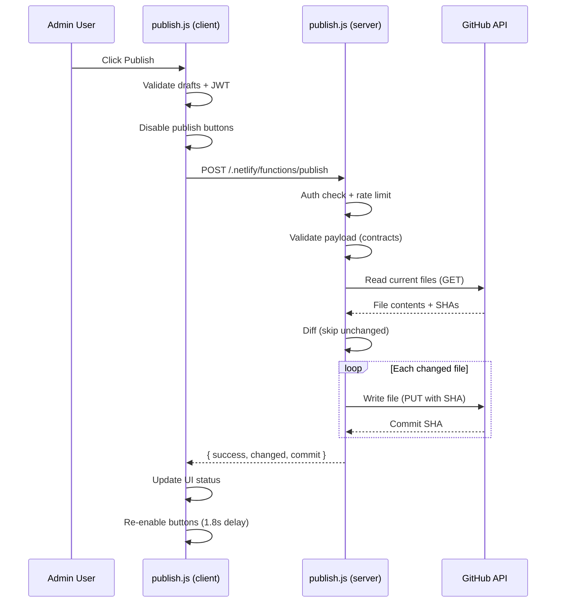

# Publish Pipeline

> **Read this doc when** working on publishing, the Netlify serverless function, the admin publish module, or understanding how data flows from the admin panel to the live site.

## Contents

- [Overview](#overview)
- [End-to-End Flow](#end-to-end-flow)
- [Server Function Detail](#server-function-detail-abordfabordfabordfabordnetlifyfunctionspublishjs) — env vars, data files, behavior, errors
- [Client Module Detail](#client-module-detail-adminappmodulespublishjs) — publishChanges steps, ctx
- [Local Development](#local-development)
- [Shared Validation Contracts](#shared-validation-contracts)

---

## Overview

The publish pipeline moves data from the admin panel to the live website via Git commits. It has two sides:

| Side | File | Purpose |
|------|------|---------|
| **Client** | `admin/app/modules/publish.js` | Validates drafts, acquires JWT, sends payload to Netlify function |
| **Server** | `netlify/functions/publish.js` | Validates payload, reads current files from GitHub, diffs, and commits changed files |

The pipeline supports two publish targets:

| Target | Branch | Effect |
|--------|--------|--------|
| `preview` | `cms-preview` (configurable via `CMS_PREVIEW_BRANCH`) | Deploys to Netlify preview. Safe for testing. |
| `production` | `master` (configurable via `GH_BRANCH` / `GITHUB_BRANCH`) | Deploys to the live site. Requires user confirmation. |

---

## End-to-End Flow

```
1. Admin user clicks "Publish Preview" or "Publish Production"
      ↓
2. admin/app/modules/publish.js — publishChanges(target, ctx)
      ├── Guards: not already publishing, drafts exist
      ├── If production: window.confirm() dialog
      ├── Gets JWT from Netlify Identity user
      ├── Validates ingredients via validateIngredientsDraftData()
      ├── Validates categories via validateCategoriesDraftData()
      ├── Normalizes ingredient aliases
      ├── Disables all publish buttons across all panels
      ├── Updates status indicators
      ↓
3. POST /.netlify/functions/publish
      Headers: Authorization: Bearer <JWT>
      Body: { menu, availability, home, ingredients, categories, restaurant, media, target }
      ↓
4. netlify/functions/publish.js — handler(event, context)
      ├── Auth check: context.clientContext.user must exist
      ├── Env var check: GITHUB_TOKEN, GITHUB_OWNER, GITHUB_REPO
      ├── Parse and normalize JSON payload
      ├── Rate limit check (30s window per user)
      ├── Validate ingredients payload (shared/ingredients-contract.js)
      ├── Validate categories payload (shared/categories-contract.js)
      ├── If preview: ensure preview branch exists (created from production if missing)
      ├── Read current file contents from GitHub (GET /repos/.../contents/...)
      ├── Diff: compare normalized JSON of each file
      ├── If no changes: return { skipped: true }
      ├── For each changed file: PUT to GitHub Contents API (sequential commits)
      └── Return { success: true, changed: {...}, commit: sha }
      ↓
5. Netlify detects new commit → auto-deploys
      ↓
6. Client receives response
      ├── Updates status indicators
      ├── Re-enables publish buttons (after 1.8s delay)
      └── Shows success/failure/skip message
```



---

## Server Function Detail (`netlify/functions/publish.js`)

### Environment Variables

| Variable | Aliases | Default | Purpose |
|----------|---------|---------|---------|
| `GITHUB_TOKEN` | `GH_TOKEN` | — | **Required.** Personal access token with repo write access |
| `GITHUB_OWNER` | `GH_OWNER` | — | **Required.** GitHub repository owner |
| `GITHUB_REPO` | `GH_REPO` | — | **Required.** GitHub repository name |
| `GH_BRANCH` | `GITHUB_BRANCH` | `master` | Production branch name |
| `CMS_PREVIEW_BRANCH` | — | `cms-preview` | Preview branch name |

### Data Files Written

| Path | Payload Key | Required | Validation |
|------|------------|----------|------------|
| `data/menu.json` | `menu` | **Yes** | None (structure assumed valid) |
| `data/availability.json` | `availability` | **Yes** | None |
| `data/home.json` | `home` | Optional | None |
| `data/ingredients.json` | `ingredients` | Optional | `shared/ingredients-contract.js` |
| `data/categories.json` | `categories` | Optional | `shared/categories-contract.js` |
| `data/restaurant.json` | `restaurant` | Optional | `shared/restaurant-contract.js` |
| `data/media.json` | `media` | Optional | `shared/media-contract.js` |

### Key Behaviors

- **Diff-based commits:** Each file is read from GitHub before writing. If the normalized JSON is identical, the file is skipped. Only changed files are committed.
- **Sequential commits:** Files are committed one at a time in order: menu → availability → home → ingredients → categories → restaurant → media. Each commit gets its own message (e.g., `"CMS: update menu (production)"`).
- **Preview branch auto-creation:** If the preview branch doesn't exist, it's created from the production branch's HEAD.
- **Rate limiting:** 30-second window per user. Returns HTTP 429 with `retryAfterSeconds` if exceeded.
- **SHA tracking:** Each file read returns its current SHA. This SHA is passed to the write operation to prevent concurrent overwrite conflicts.

### Error Responses

| Status | Condition |
|--------|-----------|
| 400 | Invalid payload, missing required keys, validation errors |
| 401 | No authenticated user |
| 405 | Non-POST request |
| 429 | Rate limit exceeded |
| 500 | Missing env vars, GitHub API errors, internal errors |

---

## Client Module Detail (`admin/app/modules/publish.js`)

### `publishChanges(target, ctx)`

The single exported function. Steps:

1. **Guard:** If `state.isPublishing`, exit
2. **Guard:** All required draft types must be non-null (menu, availability, home, ingredients, categories, restaurant, media)
3. **Normalize:** Calls `ctx.normalizeIngredientsAliasesPayload()` to clean up aliases before sending
4. **Confirm:** For production target, shows `window.confirm()` dialog
5. **Auth:** Gets Netlify Identity user and extracts JWT via `user.jwt()`
6. **Validate:** Runs ingredient/category validators plus `restaurant-contract.js` and `media-contract.js`
7. **Lock UI:** Disables all publish buttons across all native panels, including Restaurant and Media when those buttons are mounted
8. **Fetch:** POST to `/.netlify/functions/publish`
9. **Handle response:** Success, skip (no changes), or error messages
10. **Restore UI:** Re-enables buttons after 1.8s timeout

### Ctx Dependencies

The publish module requires a large ctx with ~20 callbacks and references. See `docs/developers/admin/admin-modules.md` for the full ctx shape.

---

## Local Development

In local development (`npm run dev`), publishing to Netlify functions is not available. Instead, the dev server provides a **local save endpoint**:

| Endpoint | Method | Purpose |
|----------|--------|---------|
| `/__local/save-drafts` | POST | Writes draft data directly to `data/*.json` files on disk |

This endpoint accepts the same payload shape as the publish function and writes files synchronously. It does **not** validate via shared contracts and does **not** commit to Git.

---

## Shared Validation Contracts

Both the client (pre-publish) and server (during publish) use the same contract validators:

| Contract | File | Used for |
|----------|------|----------|
| Ingredients | `shared/ingredients-contract.js` | `validateIngredientsContract(payload, options)` |
| Categories | `shared/categories-contract.js` | `validateCategoriesContract(payload, options)` |
| Restaurant | `shared/restaurant-contract.js` | `validateRestaurantContract(payload, options)` |
| Media | `shared/media-contract.js` | `validateMediaContract(payload)` |

Both return `{ errors: [...], warnings: [...] }`. If `errors.length > 0`, publish is blocked.

The server-side function runs validation with `normalizeAliases: true` for ingredients, which means aliases are cleaned up before committing.
