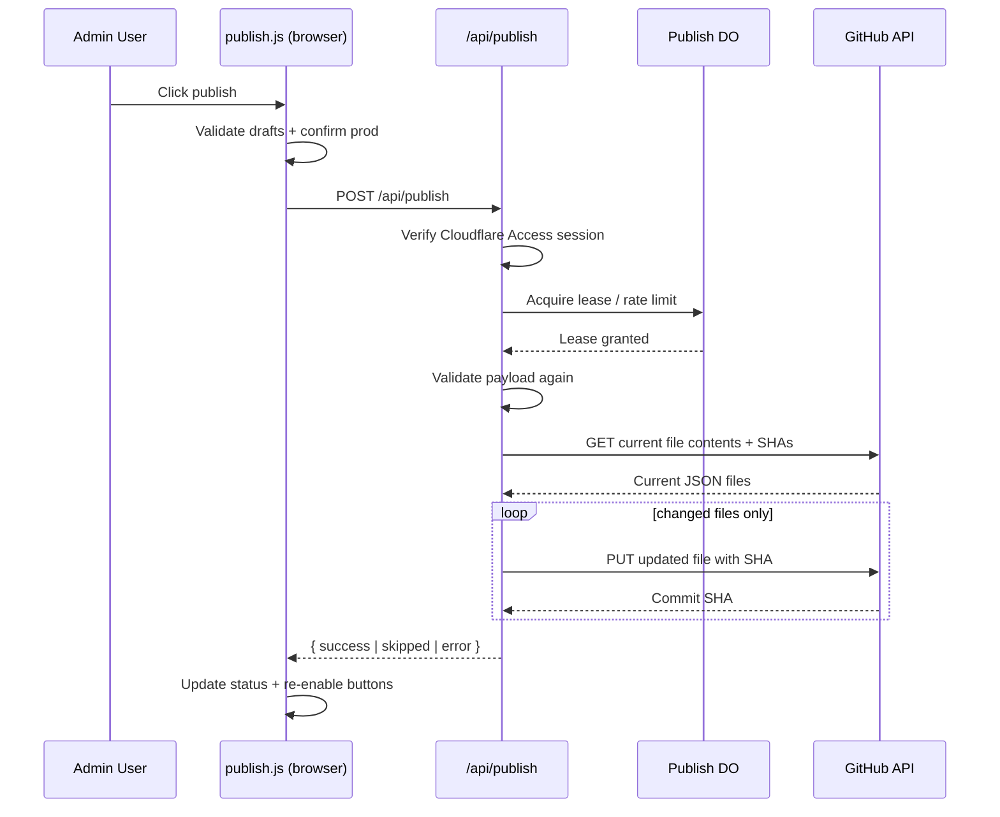

# Publish Pipeline

> **Read this doc when** working on publishing, Cloudflare admin APIs, GitHub commit automation, or the Admin buttons that push content to preview/production.

## Overview

The publish pipeline now runs on **Cloudflare**, not Netlify.

The end-to-end path is:
- Admin browser validates local drafts
- Admin browser `POST`s to `/api/publish`
- Cloudflare Admin worker validates the authenticated Access session
- A Durable Object acquires a short publish lease and rate-limits repeat clicks
- The publish service diffs `data/*.json` against GitHub and commits only changed files
- Cloudflare Pages deploys from the updated branch

## Runtime Pieces

| Piece | File | Responsibility |
|------|------|----------------|
| Client publish module | `admin/app/modules/publish.js` | Validates drafts, confirms production intent, sends the payload to `/api/publish` |
| Admin worker | `cloudflare/admin/worker.js` | Handles `POST /api/publish`, requires Cloudflare Access session, acquires publish lock |
| Publish coordinator | `cloudflare/common/publish-lock.js` | Durable Object lease + per-user rate limit |
| Publish service | `cloudflare/common/publish-service.js` | Validates payloads and writes changed files to GitHub |
| Shared validators | `shared/*-contract.js` | Same schema guards used by the browser and the worker |

## Targets and Branches

| Target | Branch | Effect |
|------|--------|--------|
| `preview` | `cms-preview` (`CMS_PREVIEW_BRANCH`) | Safe preview branch used by `preview.trattoriafigata.com` |
| `production` | `master` (`GITHUB_BRANCH`) | Live production branch used by `trattoriafigata.com` |

The client can only send `preview` or `production`. Arbitrary branch names are not accepted.

## End-to-End Flow

```text
1. Staff clicks "Publicar preview" or "Publicar produccion"
2. admin/app/modules/publish.js
   -> ensures drafts exist
   -> validates ingredients/categories/menu/restaurant/reservations/media
   -> confirms production publishes
   -> disables publish buttons
3. POST /api/publish
4. cloudflare/admin/worker.js
   -> requireAccessSession(request, env)
   -> acquirePublishLease(env, session)
   -> publishDrafts(body, { env, session })
5. cloudflare/common/publish-service.js
   -> validates payloads again
   -> ensures preview branch exists when needed
   -> reads current GitHub file SHAs
   -> skips unchanged files
   -> writes changed files through GitHub Contents API
6. Worker returns JSON result to the browser
7. Browser restores button state and shows success / skipped / error status
```



## Auth Model

The browser no longer acquires a JWT from an in-app identity widget.

Production/preview auth now comes from **Cloudflare Access**:
- users sign in with Google before the app loads
- the Admin worker verifies the Access JWT from the request cookies/headers
- the publish endpoint trusts the verified Access identity, not browser-supplied user fields

Local development still supports `?devAuthBypass=1`, but the local dev server returns a `501` for `/api/publish` because it does not push to GitHub.

## Request Contract

`POST /api/publish`

```json
{
  "menu": {},
  "availability": {},
  "home": {},
  "ingredients": {},
  "categories": {},
  "restaurant": {},
  "reservations": {},
  "media": {},
  "target": "preview"
}
```

Required keys:
- `menu`
- `availability`
- `home`
- `ingredients`
- `categories`
- `restaurant`
- `reservations`
- `media`

Optional:
- `target` -> `preview` or `production`

## Environment Variables / Secrets

These values belong in Cloudflare Admin worker config/secrets, not in the frontend:

| Variable | Required | Purpose |
|------|----------|---------|
| `GITHUB_TOKEN` | Yes | GitHub token with repo write access |
| `GITHUB_OWNER` | Yes | Repository owner |
| `GITHUB_REPO` | Yes | Repository name |
| `GITHUB_BRANCH` | No | Production branch, default `master` |
| `CMS_PREVIEW_BRANCH` | No | Preview branch, default `cms-preview` |
| `FIGATA_ACCESS_TEAM_DOMAIN` | Yes | Access team domain used to validate session JWTs |
| `FIGATA_ACCESS_ALLOWED_AUDS` | Yes | Allowed Cloudflare Access audience IDs |

## File Writes

The publish service can write these files:

| Path | Payload key | Validation |
|------|-------------|------------|
| `data/menu.json` | `menu` | menu-specific browser validation before submit |
| `data/availability.json` | `availability` | browser/runtime shape assumed valid |
| `data/home.json` | `home` | `validate:home` in repo tooling |
| `data/ingredients.json` | `ingredients` | `shared/ingredients-contract.js` |
| `data/categories.json` | `categories` | `shared/categories-contract.js` |
| `data/restaurant.json` | `restaurant` | `shared/restaurant-contract.js` |
| `data/reservations-config.json` | `reservations` | `shared/reservations-contract.js` |
| `data/media.json` | `media` | `shared/media-contract.js` |

## Safety Guarantees

- **Lease lock:** prevents two tabs from publishing at the same time
- **Rate limit:** blocks repeated publish attempts within a short cooldown
- **Diff-based writes:** unchanged files are skipped
- **SHA checks:** GitHub Contents API rejects stale overwrites
- **Dual validation:** browser validates first, worker validates again
- **No arbitrary branch writes:** only `preview` and `production`

## Local Development

`npm run dev` exposes a Cloudflare-shaped API surface so the Admin can boot locally:

| Endpoint | Method | Behavior |
|------|--------|----------|
| `/api/session` | GET | Returns a local bypass session |
| `/api/publish` | POST | Returns `501` with a clear local-only message |
| `/__local/save-drafts` | POST | Writes draft JSON files directly to disk for local experimentation |

Use the local save endpoint only for local iteration. It is not part of the production Cloudflare publish flow.

## Validation and Testing

Recommended checks after publish-pipeline changes:

```bash
npm run check:admin-ui
npm run validate:restaurant
npm run validate:reservations
npm run validate:media
npm run validate:analytics-ai-analyst
npm test
```

## Legacy Notes

- `netlify/functions/publish.js` is now **legacy/archive context**, not the supported runtime path.
- `admin/cms/` is archived and excluded from Cloudflare build outputs.
